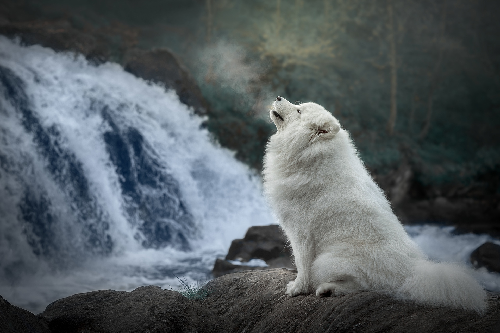
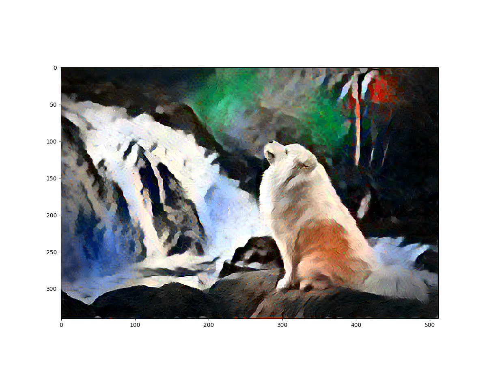

# paint-it

   How about we paint our images in similar manner as Van Gogh painted Starry Night! Looks quite impossible but thanks to Neural Style Transfer, it is actually possible!
   
   The model uses pretrained VGG-19 network for image features extraction. Now there is a content image which is our original image and a style image is given to the model say Van Gogh's Starry Night. The goal is to construct an image that has same content but the style matches the painting as if the Van Gogh himself painted that.
   
#### Style_Image: Udnie by Francis Picabia

#### Content_Image: Samoyed sitting near a waterfall

#### Image_Result:

   The lower conv layers of VGG-19 are used for style extraction because they give more details of how the style texture is constructed. For content, higher conv layers are used as they retain the spatial information of the image which is vital for image construction. As for loss optimization, Mean Square Error is computed by comparing Gram Matrix of the resulting image and style image, which is then optimized in order to progress the image construction in same style.
   
   This repo follows tensorflow implementation of neural style transfer.
   https://www.tensorflow.org/beta/tutorials/generative/style_transfer
